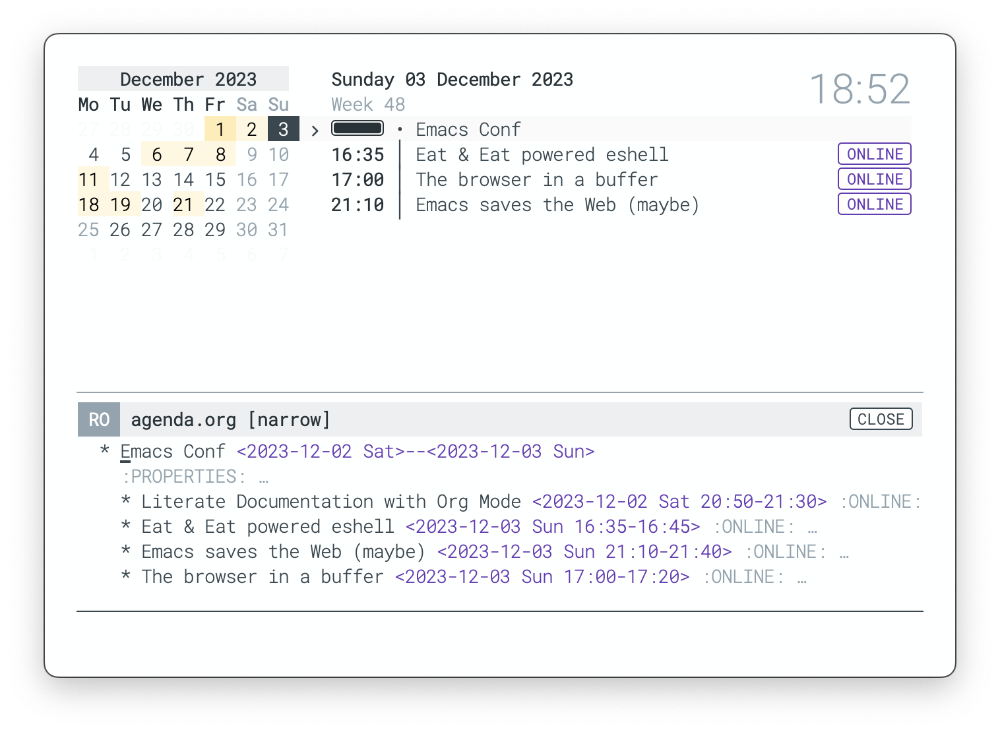

## GNU Emacs / N Λ N O Agenda

N Λ N O agenda is a minimal view of your org agenda files. It displays
a calendar view of current month (or the month corresponding to the
current selected date) alongside a view of your agenda displaying
timestamped entries. 

